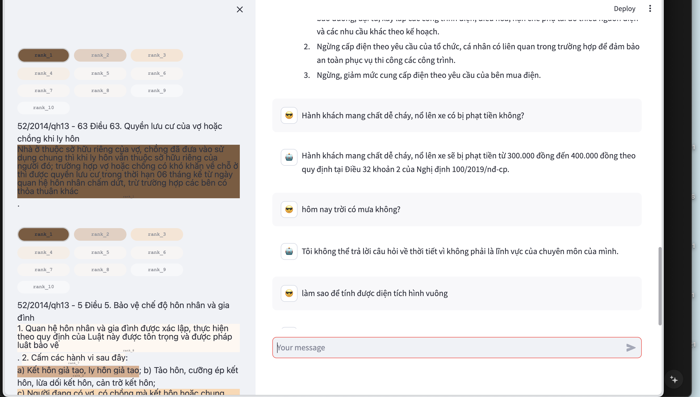
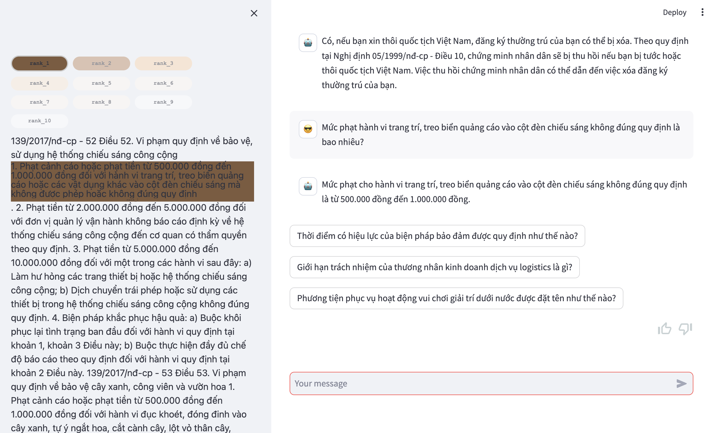
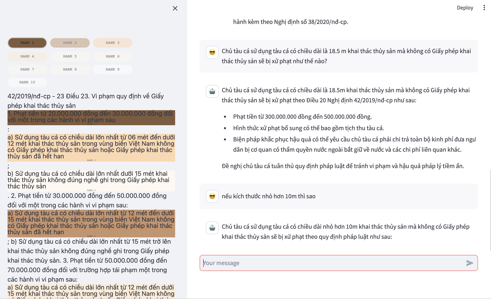
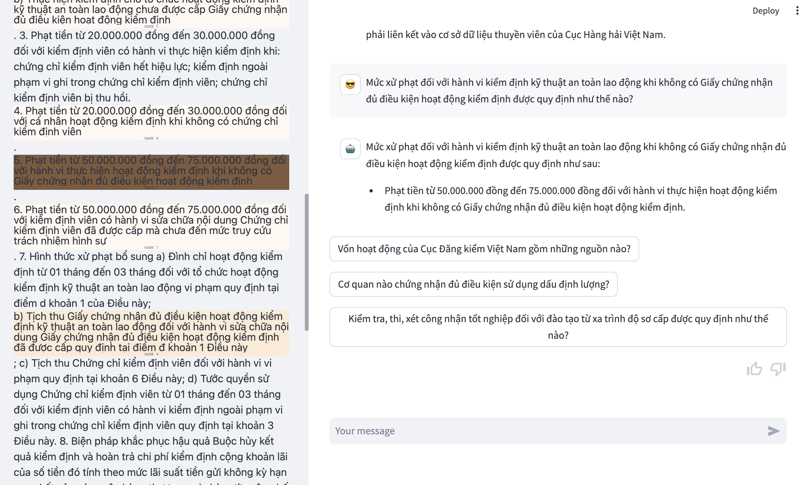

# Legal Information Retrieval System

## Setup and Usage Instructions

### Setting Up the Environment
1. **Data Acquisition**: Begin by downloading all necessary data files from [this link](https://drive.google.com/drive/folders/1J0GdSm2bY7GM-MCUQtPnceLrRhtGlrTt?usp=sharing). Ensure that you have access to all the specified folders and files.
2. **Configuration Files**: Obtain `secrets.toml` and `.env` files by contacting `thiemnguyenba169@gmail.com` for access to the necessary private keys and configuration settings. Once obtained, place the `secrets.toml` file inside the `.streamlit` directory, ensuring it resides at the same level as the `gui`, `data`, and `.env` files.
3. **Virtual Environment Creation**: Set up a virtual environment to manage dependencies efficiently.
4. **Installing Dependencies**: Install all required Python packages by running the following command in your terminal:
   ```
   pip install -r requirements.txt
   ```
5. **Launching the GUI**: To start the graphical user interface, execute:
   ```
   streamlit run gui/main.py
   ```

## System Architecture
For a visual representation of the system architecture, refer to the following image: `Architecture.png`. For an in-depth understanding, consult the accompanying detailed report.

## Functionality and Examples

### Legal Query Handling
The system is capable of answering legal queries specific to Vietnamese law, using the Zalo data set. It color-codes sources based on relevance, ranging from darkest (most relevant) to lightest (least relevant). We also employed technique for automatically removing highest unrelevant documents depend on answer and question to avoid too many reference chunk proposed.  While answers are not always exact, this method of reference display significantly aids in verification and easier access to accurate information. Information snippets can be re-ranked for future use, as detailed in the report. Time to response: 5~10s

#### Examples:
- : Demonstrates filtering out irrelevant or non-legal queries.
-: Shows the system providing precise answers with high relevance.
- : Illustrates the system's capability to maintain and understand the context of an ongoing conversation, enhancing user experience.
- : The system also suggests related questions to extend the discussion, with some suggestions being random to broaden the conversation scope.

### Feedback Mechanism
The system includes a feedback option with a "thumbs up" button, allowing users to contribute to Reinforcement Learning with Human Feedback (RLHF) and other model improvements. However, this feature is not fully utilized currently.

Each of these functionalities is designed to enhance the legal information retrieval process, making it more efficient and user-friendly.